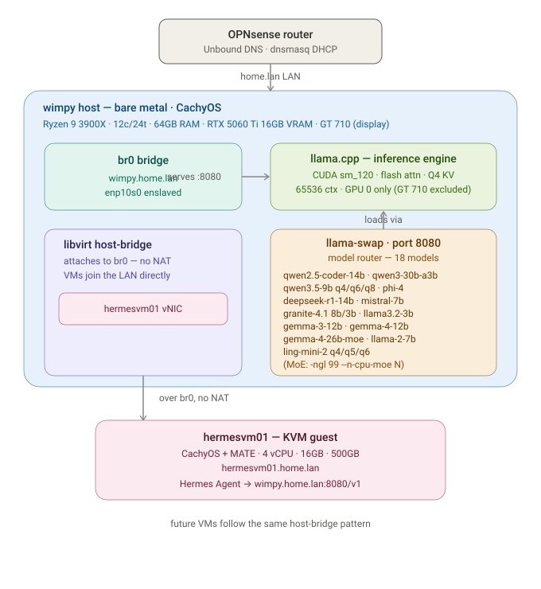

# Network topology — wimpy + hermesvm01



*Rendered diagram above; ASCII version below for terminals / plain-text viewers.*


*(SVG above; ASCII version below for terminals / plain-text viewers.)*

```
                    ┌──────────────────────────────────────────┐
                    │            OPNsense router               │
                    │     Unbound DNS  ·  dnsmasq DHCP          │
                    └────────────────────┬─────────────────────┘
                                         │
                                  home.lan LAN
                                         │
 ┌───────────────────────────────────────▼─────────────────────────────────────┐
 │ wimpy host — bare metal · CachyOS                                             │
 │ Ryzen 7 7700 (8c/8t) · 32GB RAM · R9700 32GB (ROCm) + RTX 5060 Ti 16GB (CUDA) │
 │                                                                               │
 │   ┌───────────────────────────┐  serves   ┌───────────────────────────────┐  │
 │   │ br0 bridge                │  :8080     │ llama.cpp — 2 backends        │  │
 │   │ wimpy.home.lan            │◀──────────│ ROCm → R9700 32GB             │  │
 │   │ lan0 enslaved             │            │ CUDA → 5060 Ti 16GB           │  │
 │   │                           │            │ 64K ctx · fa · Q4 KV          │  │
 │   └───────────────────────────┘            └───────────────┬───────────────┘  │
 │                                                            │ loads via        │
 │   ┌───────────────────────────┐            ┌───────────────▼───────────────┐  │
 │   │ libvirt host-bridge       │            │ llama-swap · port 8080        │  │
 │   │ attaches to br0 — no NAT  │            │ router · 2 GPU groups         │  │
 │   │ VMs join the LAN directly │            │                               │  │
 │   │ ┌───────────────────────┐ │            │ qwen2.5-coder-14b             │  │
 │   │ │ hermesvm01 vNIC       │ │            │ qwen3-30b-a3b (MoE)           │  │
 │   │ └───────────────────────┘ │            │ qwen3.5-9b q4/q6/q8           │  │
 │   └─────────────┬─────────────┘            │ phi-4 · deepseek-r1-14b       │  │
 │                 │                          │ mistral-7b · llama3.2-3b      │  │
 │                 │                          │ granite-4.1 8b/3b             │  │
 │                 │                          │ gemma-3-12b · gemma-4-12b     │  │
 │                 │                          │ gemma-4-26b-moe (MoE)         │  │
 │                 │                          │ ling-mini-2 q4/q5/q6 (MoE)    │  │
 │                 │                          │ llama-2-7b                    │  │
 │                 │                          └───────────────────────────────┘  │
 └─────────────────┼───────────────────────────────────────────────────────────┘
                   │  over br0, no NAT
                   ▼
       ┌──────────────────────────────────────────────────────┐
       │ hermesvm01 — KVM guest                               │
       │ CachyOS + MATE · 4 vCPU · 16GB · 500GB               │
       │ hermesvm01.home.lan                                 │
       │ Hermes Agent  →  http://wimpy.home.lan:8080/v1      │
       └──────────────────────────────────────────────────────┘

   future VMs follow the same host-bridge pattern
```

## Hosted models

llama-swap routes on demand across two GPU groups: 26 models on the R9700
(ROCm) and 19 `<16GB` models on the RTX 5060 Ti (CUDA). Within a group one
model is resident at a time; because the groups are `exclusive: false`, one
model per GPU can be resident **at once**, so two agents run in parallel — one
per card. `ttl` unloads idle models. On the 32GB R9700 all MoE experts now fit
on the GPU (`--n-cpu-moe 0`); the table below lists the model families.

| Model key          | Notes                                         |
|--------------------|-----------------------------------------------|
| qwen2.5-coder-14b  | Coding workhorse / Claude Code fallback       |
| qwen3-30b-a3b      | MoE, 3B active — strong all-rounder           |
| qwen3.5-9b-q4/6/8  | Claude-Opus reasoning distill (3 quants, A/B)  |
| phi-4              | Reasoning (Q4_K_M — Q8 OOMed at 64K)          |
| deepseek-r1-14b    | Reasoning distillation                        |
| mistral-7b         | Light, fast general chat                      |
| llama3.2-3b        | Tiny, instant responses                       |
| granite-4.1-8b/3b  | Efficient, enterprise-tuned                   |
| gemma-3-12b        | General (Q8_0)                                |
| gemma-4-12b        | General (Q4_K_M)                              |
| gemma-4-26b-moe    | MoE from the eval video                        |
| ling-mini-2-q4/5/6 | MoE, millisecond responses (3 quants)          |
| llama-2-7b         | Legacy (2023) — kept for comparison            |

## How it works

- **One bridge, one LAN.** `lan0` (wimpy's physical NIC — a permanent,
  MAC-pinned name via `10-lan.link`; kernel names like enp10s0/enp8s0 drifted
  with every PCI change and kept breaking the bridge) is enslaved into
  `br0`. The host's IP lives on `br0`, not on `lan0`. The bridge MAC is pinned
  to lan0's real MAC so the OPNsense DHCP reservation matches and assigns a
  stable address. (Specific IPs/MACs are kept in OPNsense, not this diagram.)

- **Inference is two layers.** `llama.cpp` is the engine — here it's **two
  builds**: a ROCm/HIP build (`/usr/local/bin/llama-server`, gfx1201) for the
  R9700 and a CUDA build (`/opt/llama-cuda/bin/llama-server`, sm_120) for the
  RTX 5060 Ti. A single `llama-swap` sits in front of both, binds port 8080 on
  all interfaces, and loads/unloads models on demand (per-GPU groups let one
  model on each card be resident at once). Hermes and any LAN client talk only
  to llama-swap.

- **VMs are first-class LAN peers.** libvirt's `host-bridge` network attaches
  guest vNICs straight onto `br0`. hermesvm01 gets its address from its own
  DHCP reservation (keyed on its vNIC MAC). No NAT, no port-forwarding — the VM
  is just another host on the LAN.

- **Inference path.** Hermes Agent inside hermesvm01 points `OPENAI_BASE_URL`
  at `http://wimpy.home.lan:8080/v1`. Traffic flows VM → br0 → llama-swap on the
  host, a single L2 hop.

- **DNS.** Unbound resolves `wimpy.home.lan` and `hermesvm01.home.lan` (plus
  PTRs). See DNS-DHCP-INSTRUCTIONS.md for the actual address assignments.

- **GPU split.** Both cards do inference, concurrently. The R9700 is pinned by
  stable UUID (`HIP_VISIBLE_DEVICES=GPU-61fe9ba05af1939a` + `--device ROCm0`) so
  the Ryzen 7700's Raphael iGPU — which also enumerates as a ROCm device — can't
  be selected by accident. The RTX 5060 Ti is pinned with `CUDA_VISIBLE_DEVICES=0`
  + `--device CUDA0`. The old GT 710 display card was removed in the platform swap.

## Adding future VMs

Each new guest follows the same pattern: attach its vNIC to `host-bridge`, note
the vNIC MAC, add a DHCP reservation and an Unbound A/PTR record, then run
`hermesvm-setup.sh --hostname <name>` inside it.
